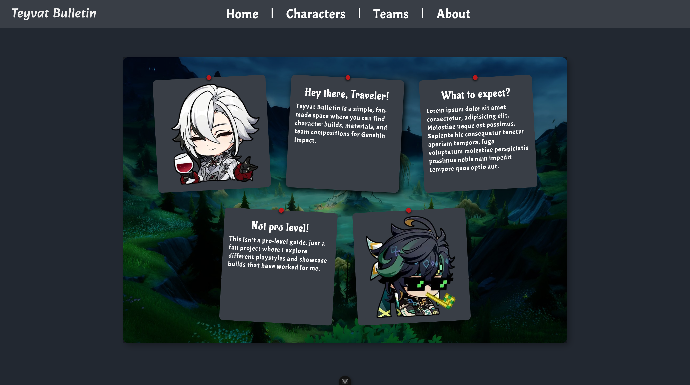

# Genshin Impact Fan-Made Website

## Table of Contents

1. [Introduction](#introduction)
2. [Features](#features)
3. [ER Diagram](#er-diagram)
3. [Preview](#preview)
5. [Contributing](#contributing)
5. [License](#license)
6. [Acknowledgements](#acknowledgements)

## Introduction

Welcome to the **Teyvat Bulletin** Repo! This project is brought to you by my passion, created as a way to combine the love of the world of Teyvat with my journey into web development. As a fan of Genshin Impact, I wanted to build something that so players can easily find builds, character mats and team compositions.

This website is **not affiliated with miHoYo** or the official Genshin Impact team. Instead, it's a **fan-made project** designed for learning purposes and as a fun hobby. I hope this project brings you as much joy as it has brought me while building it.

Feel free to explore, contribute, or provide feedback—this is a community-driven project, and I'd love to hear your thoughts!

## Features to be implement

- **Character**: Information about all Genshin Impact characters.
- **Weapon**: Information about all Weapons
- **Materials**: Information about character & weapon materials
- **Team Composition**: A list of fun and meta team compositions
- **Mobile Support**: Make it useable for mobile viewer in the future

## ER Diagram

The diagram shows the relationships between characters, weapons, and other entities in the Genshin Impact universe.
 

[View the ER Diagram on draw.io](https://viewer.diagrams.net/?tags=%7B%7D&lightbox=1&highlight=0000ff&edit=_blank&layers=1&nav=1&title=Teyvat%20Bulletin.drawio&dark=auto#Uhttps%3A%2F%2Fdrive.google.com%2Fuc%3Fid%3D1HEwfE2gX_MKPQ8343GJew_mfGIX4UlEy%26export%3Ddownload)

**This will change in the future when Im adding more to the Database**

## Preview
Everything is subject to change, so don't take it as the final product!
### The Home Page

### All Character Page

### Detailed Character Page

## Contributing

Currently, this project is not set up for collaboration as I'm still exploring the best ways to manage contributions and implement a proper DevOps setup. However, if you're interested in contributing and have experience with DevOps, CI/CD pipelines, or project collaboration tools, I'd love to hear from you!

Feel free to reach out to me with your ideas or suggestions on how we can improve the project's infrastructure. Together, we can make this fan-made website even better for the Genshin Impact community!

## License

This project is licensed under the MIT License. See the [LICENSE](LICENSE) file for details.

## Acknowledgements

- Special thanks to miHoYo for creating the amazing world of Genshin Impact.
- Thanks to the open-source community for providing tools and libraries that made this project possible.
